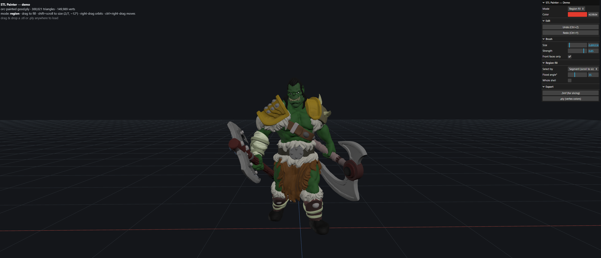

# STL Painter — Demo

> Paint colors onto 3D-printable STL models in the browser, then export
> color-capable 3MF/PLY for multi-material slicing. Built with Three.js.

**Live demo → [stl.natsirt.dev](https://stl.natsirt.dev)**

A browser-based tool for **painting colors onto 3D‑printable `.stl` models** and
exporting them to color‑capable formats that survive into slicing and
multi‑material printing.

Built with [Three.js](https://threejs.org/) (plus a small GLSL shader),
TypeScript, and Vite. Runs entirely client‑side — no server, no upload, no accounts.



## Objective

STL is the standard format for 3D printing, but it carries **geometry only — no
color**. This demo closes that gap: import a raw `.stl`, color it directly in
the browser (free‑hand or by logical part), and export a format a slicer can
read so the colors make it onto the print.

## What it can do

- **Load any `.stl`** (binary or ASCII) and render it interactively.
- **Brush paint** vertex colors directly onto the surface, with a soft falloff
  and a front‑faces‑only mode so the brush doesn't bleed through thin walls.
- **Region fill** — color a whole logical part (a boot, a hat, an axe blade) in
  one stroke. Parts are found by **crease‑bounded segmentation**, so a fill
  stops at real edges instead of spilling onto the next part.
  - **Scroll to resize** the selection through a nested hierarchy of crease
    levels (fine → coarse), and **drag to fill** several parts in one sweep.
  - A live **hover preview** highlights exactly what a click will fill.
- **Undo / redo** the full paint history.
- **Export** to **3MF** (per‑color base materials → extruders, for slicing /
  multi‑material printing) and **PLY** (per‑vertex colors).
- **Re‑import a `.ply`** to recover a previously painted model and keep editing.

### Why vertex colors + segments (not texture painting)?

Multi‑material printing assigns **regions to filaments**, not high‑resolution
textures — and STL has no UVs to paint a texture onto anyway. So the tool paints
**per‑vertex colors** and fills **per‑segment**, which is both simpler and the
correct representation for the slicing workflow. On load the triangle‑soup STL is
welded (`mergeVertices`) into an indexed mesh so colors blend continuously and
segments can be flood‑filled across shared edges. Raycasting and the brush use a
[BVH](https://github.com/gkjohnson/three-mesh-bvh) for interactive performance on
300k‑triangle meshes.

## How to interact

Load any model by **dragging a `.stl` or `.ply` onto the window** (a `.ply`
exported from this tool restores its colors).

Pick a tool with the **Mode** selector, choose a **Color**, then:

| Mode | Left‑drag | Scroll | Orbit |
| --- | --- | --- | --- |
| **Region fill** (default) | drag to fill segments | **Shift+scroll** resizes the selection | Shift‑drag or right‑drag |
| **Paint** | brush color on | zoom | Shift‑drag or right‑drag |
| **Orbit** | orbit | zoom | — |

- **Undo / Redo:** `Ctrl+Z` / `Ctrl+Y`.
- **Export:** the *Export* panel writes `.3mf` (for slicing) or `.ply`.

## Develop

```bash
npm install
npm run dev      # http://localhost:5173
```

## Build

```bash
npm run build    # type-check + bundle to dist/
npm run preview  # serve the production build locally
```

## Deploy

Pushing to `main` builds and publishes to GitHub Pages via
`.github/workflows/deploy.yml` (enable Pages → "GitHub Actions" in repo
settings). `vite.config.ts` uses a relative base so the build works under any
project‑site path.

## Project layout

```
src/
  main.ts        bootstrap, input wiring, drag-drop import, model swap
  scene.ts       renderer, camera, lights, OrbitControls
  loader.ts      STL/PLY parsing → welded, colored, paintable mesh
  painter.ts     BVH brush (raycast + sphere falloff, front-faces only)
  regions.ts     adjacency, nested crease segmentation, flood fill
  highlighter.ts region hover preview (per-vertex highlight attribute)
  history.ts     undo/redo over the vertex-color buffer
  exporters/     ply.ts (vertex colors) · threemf.ts (base materials)
  ui.ts          lil-gui control panel
```

## Note on the bundled model

The included example model is for demonstration only; drag in your own `.stl`
to use the tool with your own geometry.
